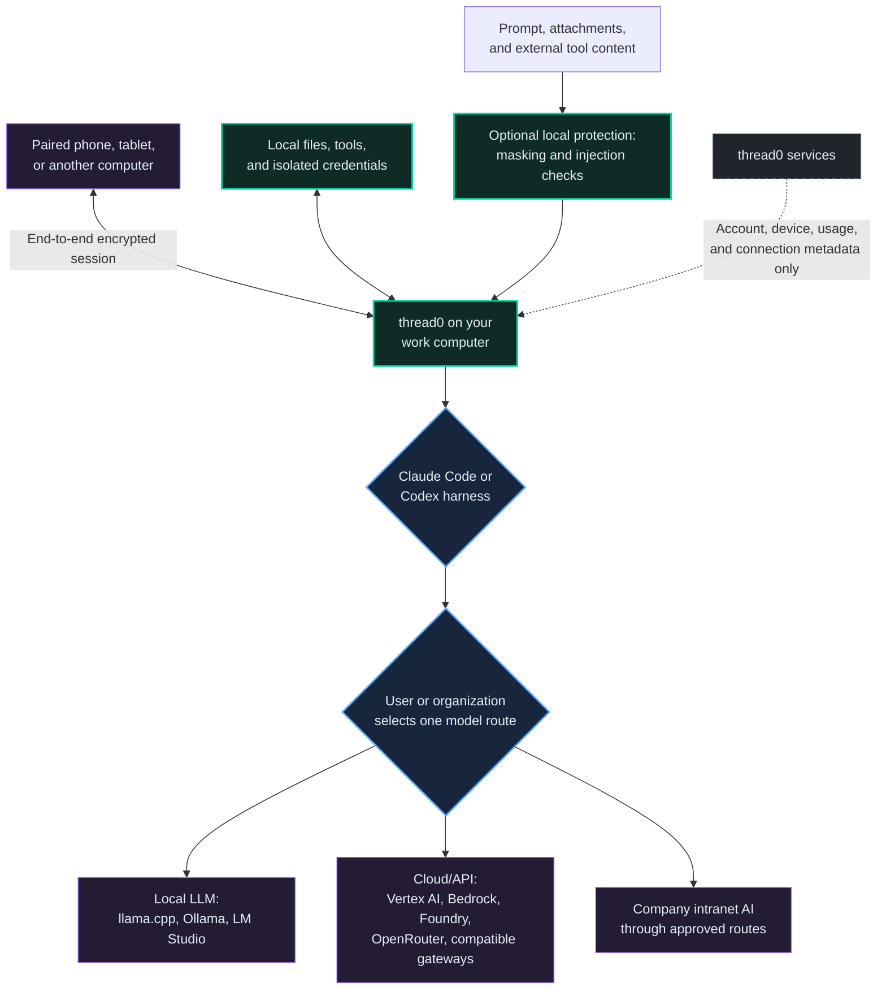
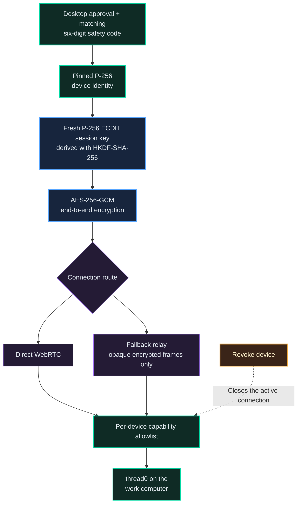

# thread0

**Every AI. Under control.**

thread0 brings the agent tools you already use into one desktop workspace. Connect multiple Claude subscription and ChatGPT/Codex accounts, keep each account isolated, hand active work to another account or engine when a limit is reached, and supervise every session from one place.

thread0 is designed to avoid creating another central store for your AI conversations. Prompts, responses, tool output, file contents, local paths, and provider credentials are not stored by a thread0 control-plane server. Content is still sent to the AI provider you choose and remains subject to that provider's data, retention, and model-training policies. If you require provider-side storage or training opt-out, you or your organization must select and configure the appropriate provider setting, plan, or contract; thread0 cannot opt out on your behalf or guarantee a provider's handling of submitted data.

This repository is the official public distribution and support page for [thread0](https://thread0.ai/). The application source code and release-signing infrastructure are maintained privately.

  

thread0 desktop session workspace. This is the shipping application—not a mockup—captured in English with isolated synthetic demo data.

## Product tour

| Home and usage overview | Local security controls |
| --- | --- |
|  |  |
| Sessions, projects, plan usage, and estimated API cost at a glance. | Personal-data masking, context protection, prompt-injection checks, local auto-run learning, and keep-awake controls. |

All product screenshots above come from the real Electron application using an isolated capture profile. Names, projects, conversations, paths, organizations, usage values, and accounts are synthetic; no production or user data is present.

## How work moves through thread0

Model content is sent only along the model path selected by the user or organization. A selected provider's data, retention, and training policies still apply, and any provider-side storage or training opt-out must be configured with that provider.

## Security before data leaves your computer

The protection path is local and optional. When enabled, masking values and the encrypted pseudonym dictionary remain on the work computer. A required check can stop transmission before content reaches a model.

```mermaid
flowchart TB
    subgraph PRESEND["ON YOUR WORK COMPUTER — BEFORE SENDING"]
        direction TB
        Content["Prompt, files, attachments,<br/>and external content"]
        PII["1 · Personal-data masking<br/>Names · contacts · IDs · cards · keys<br/>(when enabled)"]
        Context["2 · Sensitive-context masking<br/>Company · customer · domains · paths<br/>(when enabled)"]
        Inspect{"3 · Prompt-injection<br/>and required-policy checks"}
        Vault[("Encrypted pseudonym vault<br/>and masking dictionary")]
        Block["Stop before sending<br/>and ask for review"]

        Content --> PII --> Context --> Inspect
        PII -. "Pseudonyms only" .-> Vault
        Context -. "Pseudonyms only" .-> Vault
        Inspect -->|"Required check fails"| Block
    end

    subgraph MODEL["ONLY THE SELECTED MODEL ROUTE"]
        direction LR
        Provider["User-selected provider or<br/>company-approved AI"]
        Response["Encrypted model response"]
        Provider --> Response
    end

    subgraph RESTORE["ON YOUR WORK COMPUTER — RESPONSE"]
        direction TB
        Restore["Restore masked values locally"]
        Result["Response shown to the user"]
        Restore --> Result
    end

    Inspect -->|"Masked request passes"| Provider
    Response --> Restore
    Vault -. "Local lookup" .-> Restore

    classDef protect fill:#0f2b25,stroke:#00d9a3,color:#e6edf3,stroke-width:2px
    classDef vault fill:#17253d,stroke:#58a6ff,color:#e6edf3,stroke-width:2px
    classDef blocked fill:#3a2418,stroke:#f2a93b,color:#fff3cd,stroke-width:2px
    classDef external fill:#241b35,stroke:#a371f7,color:#e6edf3
    class PII,Context,Inspect,Restore protect
    class Vault vault
    class Block blocked
    class Provider,Response external
    style PRESEND fill:#111820,stroke:#00d9a3,stroke-width:2px
    style MODEL fill:#191426,stroke:#a371f7,stroke-width:2px
    style RESTORE fill:#111820,stroke:#00d9a3,stroke-width:2px
```

Prompt-injection protection specifically inspects untrusted material such as attachments and content returned by web, tool, and connector sources before model exposure. These controls reduce accidental disclosure and hostile instructions; they do not replace data-classification policy or human review.

## Everything in one agent workspace

- Connect multiple Claude subscription and ChatGPT/Codex accounts on the same computer. Authentication and configuration are isolated per account.
- Use Claude Code and Codex through one consistent interface while retaining their native harness capabilities: streaming, tool use, approval requests, models, and reasoning controls.
- Track subscription limits, input/output/cache tokens, and estimated metered API cost in one place.
- Continue a session with another account when a quota is reached, without discarding the current workspace.
- Hand work between Claude and Codex with a recent-context summary and an explicit warning about any context that cannot be transferred exactly.
- Keep the computer awake while agents are running or waiting for approval, with separate display and battery controls.

## Connect the models and infrastructure you already use

thread0 supports local, cloud, and organization-managed model paths:

- Local GGUF models through the embedded llama.cpp runtime.
- Ollama and LM Studio/OpenAI-compatible local servers.
- Google Vertex AI, including supported Claude and Gemini paths.
- Amazon Bedrock and Microsoft Azure AI Foundry.
- OpenRouter and organization-approved Anthropic/OpenAI-compatible gateways.
- AI services deployed inside a corporate network through signed organization policy, an allowlisted managed gateway, and a local bridge where required.

Provider credentials stay in the appropriate local OS/cloud credential chain or the organization's managed secret store. Arbitrary endpoints are not silently trusted: managed deployments can restrict approved URLs, models, capabilities, and network routes.

## Security and privacy by design

### Local privacy protection

- **Personal data protection (Beta):** before a request is sent, thread0 can replace names, contact details, national identifiers, payment-card data, and API keys with pseudonyms, then restore the placeholders locally in the response.
- **Sensitive context protection (Beta):** company, product, and customer names you specify can be masked along with recognizable domains, infrastructure identifiers, absolute local paths, and repository URLs.
- Detection rules and the masking dictionary remain on the computer. The pseudonym vault is encrypted with AES-256-GCM, blocked from agent-tool access, and removed with the session.

These protections reduce accidental disclosure; they do not replace data-classification policy or human review.

### Agent security layer

- **Prompt-injection protection (Beta):** attachments and content returned by web, tool, and connector sources are checked locally before model exposure. Suspicious instruction overrides, role impersonation, secret-exfiltration requests, hidden actions, approval bypasses, dangerous commands, hidden comments, and invisible control characters can be stopped for review.
- Per-turn permission modes and explicit approval cards keep consequential tool actions visible.
- Learned auto-run decisions stay in a local ledger. Repeated safe approvals can reduce routine prompts, while irreversible actions such as deletion, force-push, application restart, and cloud-resource removal continue to require human confirmation.
- Security decisions, denials, and failures remain visible in chronological tool records without displacing the conversation that triggered them.

### Isolation, updates, and recovery

- Claude and Codex credentials and configuration directories are isolated per account.
- Windows releases are Authenticode-signed. macOS releases are Developer ID signed, Apple-notarized, and stapled.
- Stable update metadata is served over HTTPS and verified against the expected file size and SHA-512 digest.
- Diagnostics are designed to omit account names, messages, work files, and credentials.
- Safe mode can stop remote access, routines, and update auto-start while restoring the interface to a recoverable state.

## thread0 Remote — secure access from your other devices

thread0 Remote pairs a phone, tablet, or another computer with the thread0 desktop app, so you can use the agents attached to your work computer from anywhere. If the computer you used last is unavailable, Remote explains the state and keeps recovery, refresh, account switching, and your other computers within reach.

- First-time pairing requires an explicit desktop approval and a matching six-digit safety code.
- Device identity is pinned with a P-256 public-key fingerprint. An unexpected key change requires re-pairing.
- Session traffic is end-to-end encrypted with AES-256-GCM using P-256 ECDH and HKDF-SHA-256; fresh ephemeral session keys provide forward secrecy.
- Direct WebRTC is preferred. When direct connectivity is unavailable, the fallback relay carries opaque encrypted frames and does not persist or decrypt conversation content. It can observe limited connection metadata and traffic volume.
- Each paired device has revocable capability switches and a remote-method allowlist. Revocation closes the active connection.
- Attachment access is constrained by path containment, symlink rejection, size limits, and sandboxing of untrusted HTML/SVG content.

## Invite collaborators

thread0 can give a scoped, audited seat on your work computer to a collaborator you choose — a developer, contractor, specialist, or colleague — without sharing accounts or passwords.

- **Email-bound invitations** with a role you pick: observe (read-only), collaborate (send messages, run sessions, respond to approvals), or full (adds terminal and file transfer). The collaborator signs in with that verified email; collaborator access does not reuse the personal-device pairing code flow.
- **Collaborators see only what you invited them to** — the sessions they started or the ones you explicitly shared, never everything running on your machine.
- **Folder and capability limits per collaborator**, with file downloads and uploads gated and every action recorded in an audit log you can review.
- **Time-boxed by default.** Access ends at expiry (extendable by you) and can be revoked at any moment; revocation closes the live connection immediately.

## Work inside your own signed-in Chrome

Agents can drive the browser you already use — with your logins, cookies, and extensions — instead of a blank automation browser.

- Install the official Playwright Chrome extension once; every connection is a normal Chrome permission prompt you approve, and tab groups show exactly what the agent can reach.
- This is how an agent gets past login walls legitimately: WordPress admin screens, internal consoles, SaaS settings — the work happens in your session, on your machine, with your approval.
- Works with both Claude and GPT sessions; the old debug-port method remains as a clearly labeled legacy option.

## Automation without giving up control

thread0 learns from frequently repeated local approvals and denials to streamline routine work. The learning record is kept on the computer and is not sent to the model or thread0 servers. High-impact and irreversible actions retain a human checkpoint, and every active session can prevent the computer from sleeping until work or an approval wait is complete.

## 한국어 핵심 요약

- 여러 Claude 구독 계정과 ChatGPT/Codex 계정을 한 컴퓨터에 연결하고, 계정별 인증 정보를 격리해 한곳에서 사용할 수 있습니다.
- Claude Code와 Codex의 스트리밍·도구·승인·모델·사고 강도 같은 하네스 기능을 하나의 UI에서 관리할 수 있습니다.
- thread0 중앙 서버가 프롬프트, 응답, 도구 출력, 작업 파일이나 경로, AI 자격 증명을 별도로 저장하지 않습니다. 단, 선택한 AI 제공자에는 요청이 전달되며 해당 제공자의 저장·학습·보존 정책이 적용됩니다. 제공자 측 저장이나 학습 제외가 필요하면 사용자 또는 조직이 해당 제공자의 설정·플랜·계약에서 직접 옵트아웃해야 하며, thread0가 이를 대신 보장하지는 않습니다.
- llama.cpp GGUF, Ollama, LM Studio 같은 로컬 모델과 Google Vertex AI, Amazon Bedrock, Microsoft Azure AI Foundry, OpenRouter 및 승인된 호환 게이트웨이를 연결할 수 있습니다.
- 사내망 AI는 서명된 조직 정책, 허용 목록, 관리형 게이트웨이와 필요한 경우 로컬 브리지를 통해 Claude/Codex 작업 흐름에 연결할 수 있습니다.
- 구독 한도, 입력·출력·캐시 토큰, 종량제 API 예상 비용을 한곳에서 확인할 수 있습니다.
- 계정 한도가 차면 같은 엔진의 다른 계정으로 세션을 이어가거나, 최근 맥락 요약과 함께 Claude와 Codex 사이에서 작업을 넘길 수 있습니다.
- 스마트폰·태블릿·다른 컴퓨터는 데스크톱 승인과 안전 코드로 페어링되며, 종단간 암호화된 기기간 연결로 업무 컴퓨터의 에이전트를 사용할 수 있습니다.
- **thread0 Remote**: 마지막에 쓰던 PC가 응답하지 않으면 실제 연결 상태를 확인하며, 재연결·새로고침·계정 전환과 다른 PC 선택으로 복구할 수 있습니다.
- **외부 개발자 위임(FDE)**: 인증된 이메일 초대로 관찰·협업·전체 중 역할을 정해 접근을 위임합니다. 기간 만료·즉시 회수·폴더 제한이 있고, 게스트는 초대받은 세션만 보며 모든 행위가 감사 기록에 남습니다.
- **내 크롬 이어받기**: 공식 Playwright 확장으로 이미 로그인된 크롬에서 에이전트가 일합니다 — 연결마다 크롬에서 직접 승인하며, 관리자 화면·사내 콘솔처럼 로그인이 필요한 작업이 가능해집니다.
- 개인정보와 지정한 회사·제품·고객명, 도메인·인프라 식별자·로컬 경로 같은 민감 정보를 로컬에서 자동 마스킹한 뒤 응답에서 복원할 수 있습니다(Beta).
- 첨부파일과 웹·도구·커넥터 콘텐츠의 프롬프트 인젝션, 지시 덮어쓰기, 비밀정보 탈취, 승인 우회, 숨은 명령을 로컬 보안 계층에서 탐지하고 검토할 수 있습니다(Beta).
- 자주 반복하는 승인 패턴은 로컬에서 학습해 자동화를 늘리되, 삭제·강제 푸시·클라우드 자원 제거 같은 비가역 작업은 사람이 계속 확인합니다(Beta).
- AI 세션이 실행 중이거나 승인 대기 중일 때 컴퓨터 절전을 방지할 수 있습니다.

## Resumen en español

- Conecta varias cuentas de suscripción de Claude y de ChatGPT/Codex en un solo equipo, con las credenciales de cada cuenta aisladas, y gestiona todas las sesiones desde un mismo lugar.
- El servidor central de thread0 no almacena tus prompts, respuestas, salidas de herramientas, archivos ni credenciales de IA. El contenido sí se envía al proveedor de IA que elijas y queda sujeto a sus políticas de retención y entrenamiento.
- Conecta modelos locales (llama.cpp GGUF, Ollama, LM Studio) y rutas en la nube (Google Vertex AI, Amazon Bedrock, Azure AI Foundry, OpenRouter y pasarelas compatibles aprobadas), además de IA corporativa mediante políticas firmadas.
- Consulta en un solo lugar los límites de suscripción, los tokens de entrada/salida/caché y el coste estimado de API.
- Cuando una cuenta alcanza su límite, continúa la sesión con otra cuenta del mismo motor o traspasa el trabajo entre Claude y Codex con un resumen del contexto reciente.
- **thread0 Remote**: teléfono, tableta u otro equipo emparejados con aprobación en el escritorio y código de seguridad, con cifrado de extremo a extremo. Si el PC no responde, Remote conserva las acciones de recuperación, cambio de cuenta y selección de otro PC.
- **Delegación a desarrolladores externos (FDE)**: invitaciones vinculadas a un correo verificado con rol (observar, colaborar o total), límite de tiempo y de carpetas, revocación inmediata y registro de auditoría de cada acción. Los invitados solo ven las sesiones a las que fueron invitados.
- **Trabaja en tu propio Chrome con sesión iniciada**: con la extensión oficial de Playwright, el agente usa tu navegador real — tus inicios de sesión y extensiones — aprobando cada conexión en Chrome. Ideal para paneles de administración y consolas internas.
- Enmascaramiento local de datos personales y de nombres de empresa/producto/cliente, con restauración en las respuestas (Beta); detección local de inyección de prompts en adjuntos y contenido de herramientas (Beta).
- Los patrones de aprobación repetidos se aprenden localmente para ampliar la automatización, mientras las acciones irreversibles siguen requiriendo confirmación humana (Beta).

## Download

Current stable release: **0.1.233**

| Platform | Download | Requirements |
| --- | --- | --- |
| Windows | [thread0 0.1.233 for Windows](https://storage.googleapis.com/gendistrict-agentdeck-updates/releases/0.1.233/windows/x64/thread0%20Setup%200.1.233.exe) | Windows 10/11, x64 |
| macOS | [thread0 0.1.233 for macOS](https://storage.googleapis.com/gendistrict-agentdeck-updates/releases/0.1.233/macos/arm64/thread0-0.1.233-arm64.dmg) | macOS 13+, Apple Silicon |

The desktop downloads use immutable, version-specific URLs. Checksums are published in [SHA512SUMS.txt](SHA512SUMS.txt).

## Verify the installers

- Windows installers are Authenticode-signed by `MAI DEPOT, Inc`.
- macOS installers are signed with Developer ID Application `MAIDEPOT, Inc (WAH9N3NJX5)`, notarized by Apple, and stapled.
- Compare the downloaded file with [SHA512SUMS.txt](SHA512SUMS.txt) before installation when independent verification is required.
- **Seeing a caution from Windows or your browser?** That is normal for a newer release while it builds reputation. In the browser choose **Keep**; if SmartScreen appears, check that the publisher reads `MAI DEPOT, Inc` and choose **More info → Run anyway**. macOS builds are notarized and open without warnings.

## Accounts and provider responsibility

thread0 does not provide Claude, ChatGPT, Codex, model-API, cloud-provider, or connector subscriptions. Users and organizations remain responsible for their accounts, provider terms, data policies, provider-side storage or training opt-out, configuration, and usage charges. Feature availability can vary by provider, operating system, account plan, and organization policy.

## Support

- For ordinary bugs and feature requests, use this repository's Issues page.
- Do not attach access tokens, credentials, private conversation transcripts, source files, or unreviewed diagnostic files.
- For security issues, follow [SECURITY.md](SECURITY.md) and report privately.

## Legal

thread0 is proprietary software distributed by MAI DEPOT, Inc. GenDistrict operates the service in Chile. No open-source license is granted by this repository. See [TERMS.md](TERMS.md), [PRIVACY.md](PRIVACY.md), and [NOTICE.md](NOTICE.md).

Copyright © MAI DEPOT, Inc. All rights reserved.
